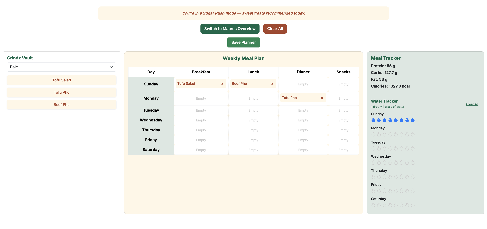

# da grindz

**Da Grindz** is a web application designed to support healthier eating habits for students and staff at UH Mānoa. It combines personalized meal planning, nutrition tracking, and real-time campus vendor menus. One of its standout features is “Grindz Mood,” which customizes meal suggestions and interface themes based on a user’s current cravings or dietary goals.

Built Using:
- Next.js with TypeScript
- React Bootstrap for styling and layout
- PostgreSQL with Prisma ORM for the database
- Deployed with Vercel
- GitHub project boards and issue-driven development

I was responsible for designing and implementing the Planner Page. This included creating a drag-and-drop weekly meal planner, building the Grindz Vault (a centralized meal bank), adding a vendor filter, integrating macro tracking, and developing features like water logging and mood-based UI updates. I also worked on syncing planned meals with macro goals and built editable goals for users to customize their nutrition targets.

What I Learned:
- How to manage state and props in React
- How to build responsive and interactive UIs
- How to connect frontend components to backend API routes
- How to work with others using GitHub issues and branches
- How to apply user feedback to improve features

## Screenshots
Here are some screenshots from the da grindz website that I was responsible for

## Project Links
- [Live Site](https://da-grindz.vercel.app/)
- [GitHub Repository](https://github.com/da-grindz)
- [Project Homepage](https://da-grindz.github.io/)
