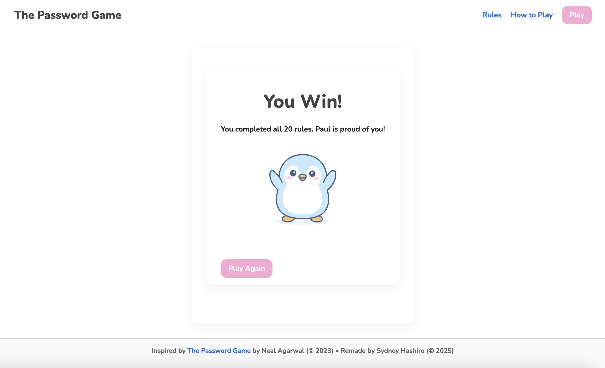

The Password Game is a web-based parody inspired by Neal Agarwal’s viral game, reimagined with a unique kawaii aesthetic, interactive rule system, and a penguin named Paul who adds an unexpected twist. The game challenges users to build a password that satisfies 20 increasingly challenging rules; from basic requirements like including a number or uppercase letter, to more constraints like feeding Paul 🐧 every 25 seconds, using a moon phase emoji, and including trivia answers. As each rule is satisfied, a new one appears, and the player must adapt their password in real-time to survive.

Built Using:
- Next.js with TypeScript for the frontend and app routing
- React Bootstrap and custom CSS for responsive, kawaii-themed styling
- Modular component structure with stateful logic and progressive rule handling
- Solo project with full responsibility for design, implementation, and testing

I developed this project solo using Next.js, TypeScript, and modular component design. I built dynamic rule validation logic, added page routing for a “How to Play” and “Rules” section, and animated Paul to bounce and celebrate when the user completes all the rules. The styling and layout were built with custom CSS and Bootstrap, giving the app a clean and responsive interface. A celebratory win page provides a satisfying end to the challenge, while maintaining the game’s lighthearted tone.

This project taught me how to organize complex conditional logic in a maintainable way, and deepened my comfort with client-side state, UI animations, and Next.js routing. I also gained experience designing for user feedback and delight — from Paul’s animation to the smooth progression of rules. It was a rewarding exercise in both frontend problem-solving and creative coding.

<h2 className="text-pink">Screenshots</h2>
Here are some screenshots from The Password Game 

<h3 className="text-pink">Paul the Penguin</h3>

<h3 className="text-pink">How to Play</h3>

<h3 className="text-pink">Rules</h3>

<h3 className="text-pink">The Game</h3>

<h3 className="text-pink">You Win!</h3>

